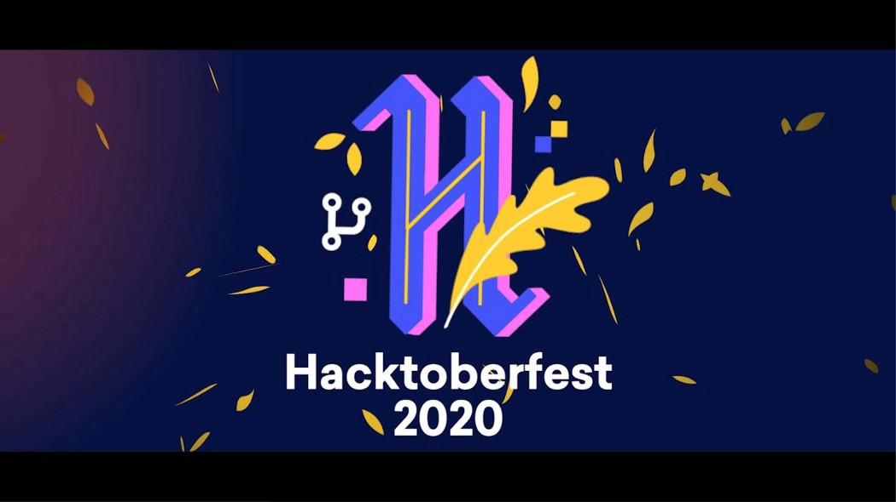
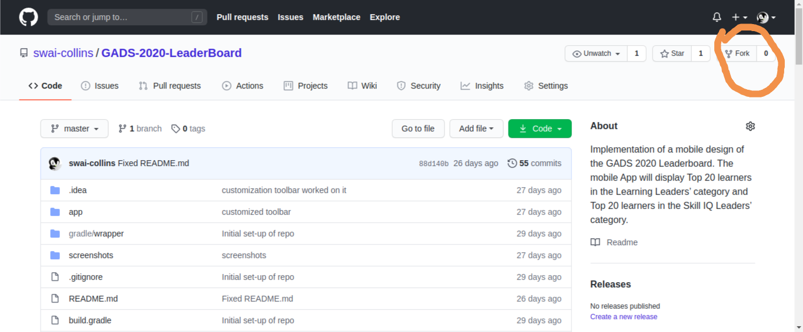
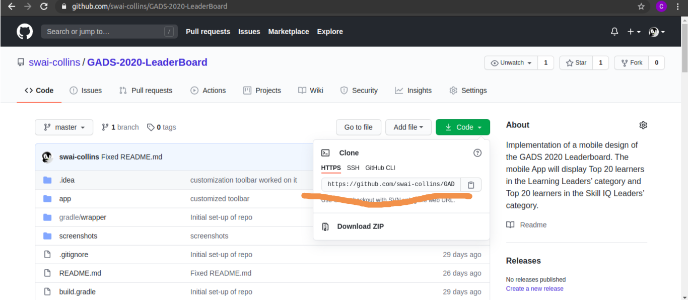
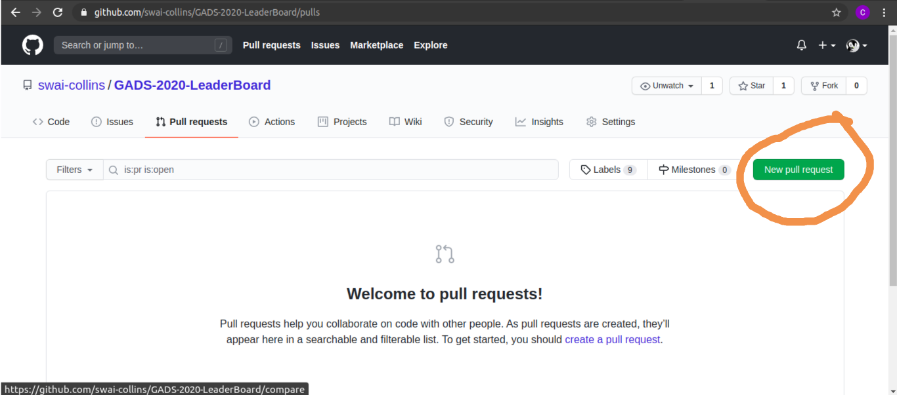

### WHAT IS HACKTOBERFEST?

**Hacktoberfest** 2020 is a month long virtual festival event to celebrate open source contributions presented by Digital Ocean, Intel and DEV. It is the easiest way to get into open source!

**Hacktoberfest** is open to everyone in our global community!

## How to Participate
1. Hacktoberfest is open to everyone in our global community. Whether you’re a seasoned contributor or looking for projects to contribute to for the first time, you’re welcome to participate.
2. Pull requests can be made in any participating GitHub-hosted repositories/projects.
3. Maintainers can opt-in to participate by classifying their projects with the hacktoberfest topic.
4. Your pull requests will count toward your participation if they are in a repository with the hacktoberfest topic and once they have been merged, approved by a maintainer or labelled as hacktoberfest-accepted.
5. Additionally, any pull request with the hacktoberfest-accepted label, submitted to any public GitHub repository, with or without the hacktoberfest topic, will be considered valid for Hacktoberfest.
6. You can sign up anytime between October 1 and October 31. Just be sure to sign up on the official Hacktoberfest website for your pull requests to count.

For participation you have some of knowledge github and git stuff. You can follow this step as well if you are now aware of it
The first thing to do is to register on the official Hacktoberfest page. Then, go check Github and start looking for projects. Here you can find the list of all the projects that voluntarily tagged themselves “Hacktoberfest”. Some maintainers also have tagged issues. You can also look at the projects you use every day, they might be open source 😉

Step 1 register or login to github[Github](https://github.com/).

Step 2 register to hacktoberfest[Hacktoberfest](https://hacktoberfest.digitalocean.com/).

Step 3 Now you have to contribue to four respostiories. You just need to fork first any repo to make your local repo then get clone of these repo.Now you can contribute these project and commit and push the code.
At last you have to create pull request for merging your code to original codebase and the maintainer review your code and can reject or merge your code.I will share you screeshot so you can understand properly.

Image | Description
------------ | -------------
  | Fork your repo
 | Clone your repo
 | Create a pull request

Step 4: Check your progress from here[Hacktoberfest](https://hacktoberfest.digitalocean.com/).

Step 5: Digital ocean will ask for shipping address via email.

Step 6: Wait for that awesome Hacktoberfest t-shirt from Github & Digital Ocean.

## Why contribute to an open-source project?
There are so many benefits to contributing to an open-source project!

1. Free swags and stickers 😉

2. Contributing to open source software will make you a better person because:

3. You expand your skillset

4. It is good for your career (don’t tell your boss, but this becomes part of your public resumé)

5. You’ll learn things you never knew, you’ll unlearn things you never knew you should 

## Do's and Dont's of Hacktoberfes
* Don't: open pull requests with minor text edits on other people's repositories

* Do: Follow a repository's contribution guidelines\

* Don't: feel intimidated

 

